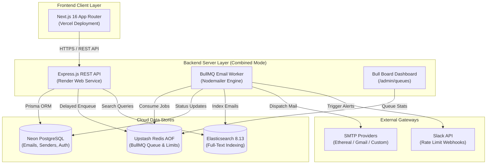
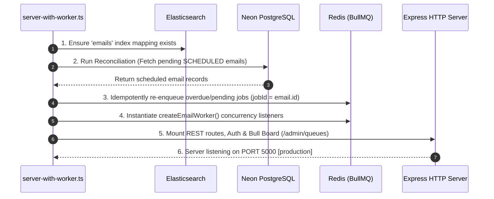
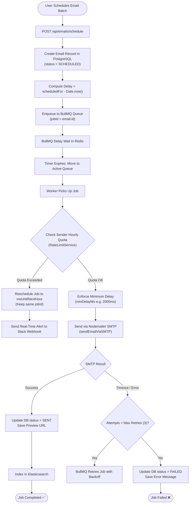

# 🏛 Workflow & Architecture Guide — ReachInbox Scheduler

This document details the architectural design, Mermaid workflow diagrams, execution modes, and deployment strategies for the **ReachInbox Full-Stack Email Job Scheduler**.

---

## 📐 High-Level System Architecture

---

## ⚡ Combined API + Worker Entry Point (`server-with-worker.ts`)

### Why Combined Mode?
Standard production architectures run the REST API and the BullMQ Background Worker as separate microservices. However, cloud platforms like **Render** charge extra for dedicated "Background Worker" instances.

To enable **100% free-tier cloud deployment**, we implemented `backend/src/server-with-worker.ts`, a combined entry point that initializes both services within a single Node.js event loop process.

---

## 🔄 Email Scheduling & Worker Lifecycle Workflow

---

## 🛡 Restart & Failover Guarantees

1. **Redis AOF Persistence:**
   Redis is configured with `--appendonly yes`, ensuring queued jobs survive Redis container or server restarts.
2. **PostgreSQL Reconciliation Engine:**
   If Redis data is lost, `reconciliation.ts` queries PostgreSQL on boot for `SCHEDULED` emails and re-enqueues them automatically.
3. **Idempotent Job IDs:**
   Every job is tagged with `jobId: email.id`. If a job is already queued in BullMQ, enqueue attempts are ignored (`no-op`), guaranteeing **zero duplicate sends**.
4. **Rate Limit Overflow Rescheduling:**
   When a sender hits their hourly quota, jobs are not failed; they are cleanly delayed to `msUntilNextHour` and a Slack alert is sent.

---

## 🚀 Free Deployment Setup Summary

| Component | Platform | Service Type | Command |
| :--- | :--- | :--- | :--- |
| **Frontend** | **Vercel** | Next.js Project | `npm run build` |
| **Backend (API + Worker)** | **Render** | Web Service (Free) | `npm run start:combined` |
| **Database** | **Neon** | PostgreSQL 16 | Automatic cloud connection |
| **Queue Store** | **Upstash** | Redis (Cloud) | Automatic TLS connection |
